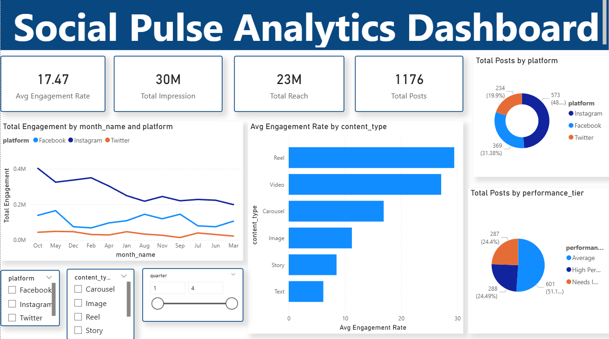
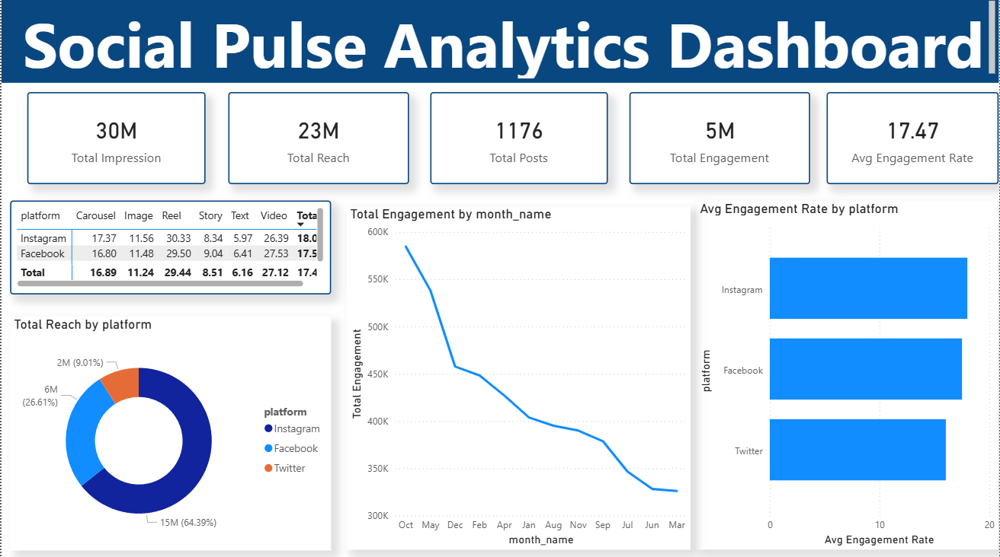
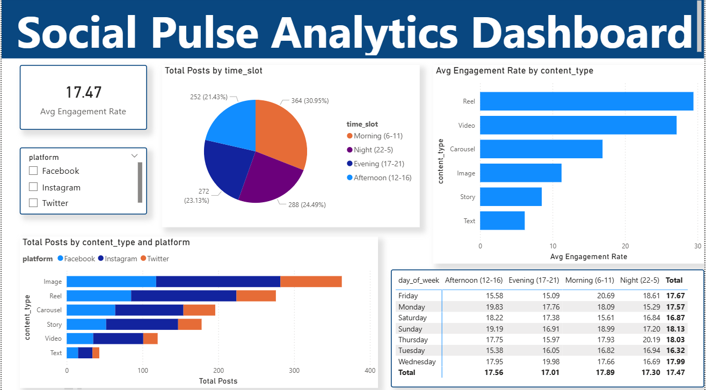

# Social Pulse Analytics

A social media analytics dashboard built with Python and Power BI.

## Tools Used
- Python (Pandas, Numpy, Matplotlib, Seaborn)
- Jupyter Notebook
- Power BI Desktop

## Files
- social_media_raw.csv - Raw data
- social_media_cleaned.csv - Cleaned data
- social-pulse-analytics.ipynb - Python analysis
- social media final project.pbix - Power BI Dashboard

## Dashboard Pages

